[](https://github.com/Omaremad763/TalkReal/actions)
[](https://github.com/Omaremad763/TalkReal)
[](https://github.com/Omaremad763/TalkReal)
[](https://github.com/Omaremad763/TalkReal)
[](https://github.com/Omaremad763/TalkReal)
[](https://github.com/Omaremad763/TalkReal)
[](https://github.com/Omaremad763/TalkReal)
[](https://github.com/Omaremad763/TalkReal)


[](https://github.com/Omaremad763/TalkReal/blob/main/LICENSE)
# TalkReal

> A full-stack real-time chat application built as a hands-on learning project to explore modern backend architecture, communication patterns, and distributed system concepts using **.NET 9** and **Angular 21**.

---

## 🌟 Highlights

- ⚡ Real-time messaging with SignalR
    
- 🧱 Clean Architecture & Domain-Driven Design (DDD)
    
- 📦 CQRS with MediatR
    
- 🔄 Reliable messaging using the Outbox Pattern
    
- 📡 Explores REST, GraphQL, gRPC, SignalR, and Webhooks
    
- 🖼️ Image messaging with Cloudinary integration
    
- 🔐 JWT Authentication with Refresh Tokens
    
- 🐳 Dockerized development environment
    
- 🚀 GitHub Actions CI pipeline
    

---
# 📑 Table of Contents

- [📖 Overview](#-overview)
- [🎯 Why This Project?](#-why-this-project)
- [🚀 Project Goals](#-project-goals)
- [🧪 Learning Experiments](#-learning-experiments)
- [✨ Core Features](#-core-features)
- [🖼️ Screenshots](#-screenshots)
- [🎥 Demo](#-demo)
- [🛠️ Technology Stack](#-technology-stack)
- [🏗️ Architecture](#-architecture)
- [🧱 High-Level Architecture](#-high-level-architecture)
- [📁 Project Structure](#-project-structure)
- [⚙️ Backend Highlights](#-backend-highlights)
- [🎨 Frontend Highlights](#-frontend-highlights)
- [🔐 Authentication](#-authentication)
- [🗃️ Messaging Module](#-messaging-module)
- [👤 Presence Module](#-presence-module)
- [📡 Communication Technologies](#-communication-technologies)
- [🐳 Docker](#-docker)
- [🚀 Getting Started](#-getting-started)
- [🔄 CI/CD](#-cicd)
- [🌿 Branching Strategy](#-branching-strategy)
- [🧪 Learning / Experimental Features](#-learning--experimental-features)
- [🔐 Security](#-security)
- [📦 Deployment](#-deployment)
- [📈 Future Roadmap](#-future-roadmap)
- [💡 Lessons Learned](#-lessons-learned)
- [❤️ Engineering Journey](#-Engineering-journey)
- [🤝 Contributing](#-contributing)
- [📄 License](#-license)
- [👨‍💻 Author](#-author)
- [⭐ Support](#-Support)
    

---

# 📖 Overview

**TalkReal** is a learning-focused full-stack chat application built to explore modern backend architecture and communication technologies through a single real-world project.

Rather than building the simplest possible chat application, the project intentionally evolves feature by feature. Each new capability represents a new engineering concept that I wanted to understand by implementing it from scratch.

The application combines multiple communication styles—including REST APIs, GraphQL, SignalR, gRPC, and Webhooks—to better understand where each technology fits, how they differ, and the problems they are designed to solve.

The result is not intended to be a production-ready messaging platform. Instead, it serves as a practical engineering playground where architectural patterns and distributed system concepts can be explored in a realistic environment.

---

# 🎯 Why This Project?

Most beginner and intermediate backend projects focus almost entirely on REST APIs.

While learning .NET, I became curious about the technologies that modern systems use beyond REST. Rather than studying each one in isolation, I decided to build a single project where every new feature became an opportunity to explore another concept.

This project gradually expanded as I learned:

- Real-time communication with SignalR
    
- Flexible querying using GraphQL
    
- Internal service communication with gRPC
    
- Reliable messaging with the Outbox Pattern
    
- Asynchronous workflows using Webhooks
    
- Dockerized development
    
- Continuous Integration with GitHub Actions
    

Instead of being driven by business requirements, TalkReal is driven by curiosity and learning.

---

# 🚀 Project Goals

The main objective of this project is to gain practical experience with modern backend architecture by implementing real features rather than isolated tutorials.

Some of the learning goals include:

- Designing applications using Clean Architecture
    
- Applying Domain-Driven Design (DDD)
    
- Separating reads and writes with CQRS
    
- Understanding real-time communication using SignalR
    
- Exploring GraphQL as an alternative to REST
    
- Learning how gRPC works and where it fits
    
- Understanding asynchronous communication through Webhooks
    
- Implementing the Outbox Pattern for reliable event processing
    
- Working with Docker and Docker Compose
    
- Automating builds with GitHub Actions
    

---

# 🧪 Learning Experiments

One of the primary goals of TalkReal is experimentation.

Some technologies included in this project are intentionally used for educational purposes, even if the current application doesn't fully require them.

These experiments helped me understand:

- When GraphQL offers advantages over REST.
    
- How SignalR manages persistent real-time connections.
    
- How gRPC differs from traditional HTTP APIs.
    
- How external services communicate through Webhooks.
    
- Why distributed systems often rely on the Outbox Pattern.
    
- How asynchronous processing improves reliability.
    
- How Docker simplifies development and deployment.
    

The focus is not on proving that every technology is necessary for this application, but on understanding when each technology becomes valuable in larger real-world systems.

---

# ✨ Core Features

### Authentication

- User Registration
    
- User Login
    
- JWT Authentication
    
- Refresh Tokens
    

---

### Presence System

- Online / Offline status
    
- Live presence updates using SignalR
    
- Automatic connection handling
    

---

### Messaging

- One-to-one conversations
    
- Real-time text messaging
    
- Image messages
    
- Chat history
    
- Message delivery workflow
    

---

### Media Support

- Image uploads
    
- Cloudinary integration
    
- Webhook callbacks
    
- Live status updates after media processing
    

---

### Communication Technologies

Instead of relying on a single communication style, TalkReal intentionally explores multiple approaches.

|Technology|Purpose in this project|
|---|---|
|REST API|Primary API layer for authentication and commands|
|GraphQL|Learning flexible data querying for chat history|
|SignalR|Real-time messaging and presence updates|
|gRPC|Experimental implementation to understand high-performance service communication|
|Webhooks|Experimental integration for asynchronous callbacks from external services|

---

# 🖼️ Screenshots

## Login

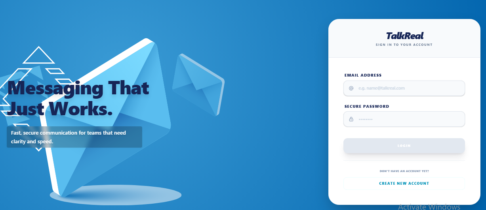

---

## Sending Messages

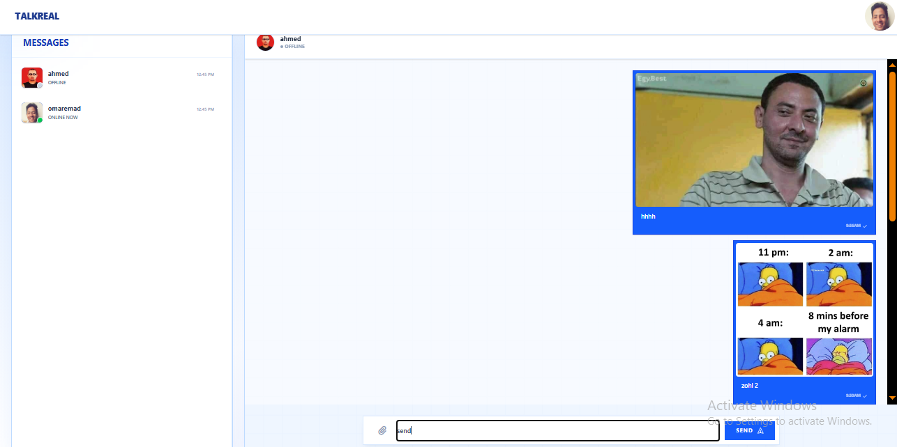

---

## Resize Profile Photo
> 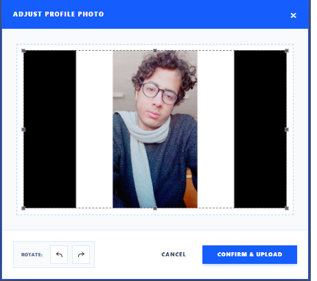

---

# 🎥 Demo

> Demo video coming soon.

---

# 🛠️ Technology Stack

## Backend

- .NET 9
    
- ASP.NET Core Web API
    
- Entity Framework Core
    
- PostgreSQL
    
- MediatR
    
- SignalR
    
- GraphQL
    
- gRPC
    
- Quartz.NET
    
- AutoMapper
    
- FluentValidation
    
- JWT Authentication
    
- Cloudinary SDK
    

---

## Frontend

- Angular 21
    
- TypeScript
    
- Tailwind CSS
    
- RxJS
    
- Apollo GraphQL
    
- SignalR Client
    

---

## DevOps

- Docker
    
- Docker Compose
    
- GitHub Actions
    
- Husky
  
- # 🏗️ Architecture

TalkReal follows the principles of **Clean Architecture**, keeping the business logic independent from frameworks, databases, and external services.

The solution is organized into separate projects, each with a clear responsibility.

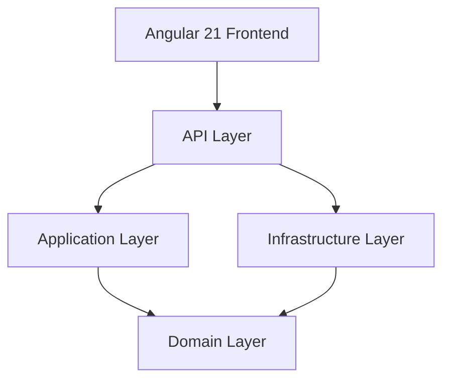

---

# 🧱 High-Level Architecture

The application is divided into independent layers that communicate through abstractions.

|Layer|Responsibility|
|---|---|
|API|REST APIs, GraphQL endpoints, Controllers, Authentication|
|Application|CQRS, Use Cases, DTOs, Interfaces|
|Domain|Business Entities, Domain Events, Value Objects|
|Infrastructure|Database, SignalR, Cloudinary, Quartz, Repositories, gRPC|
|Frontend|Angular UI, SignalR Client, GraphQL Client|

---

## Request Flow

A typical HTTP request follows the following path:

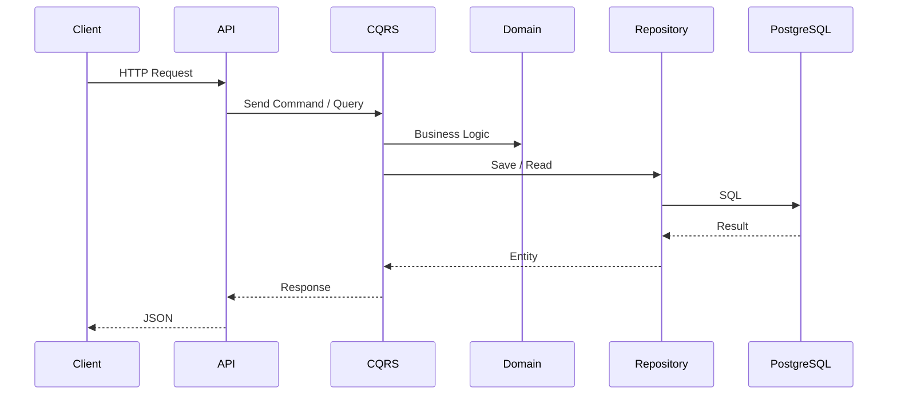

---

# 📁 Project Structure

```
TalkReal.sln

├── API
│   ├── REST Controllers
│   ├── GraphQL Endpoint
│   └── Middleware
│
├── Application
│   ├── CQRS
│   ├── DTOs
│   ├── Contracts
│   └── Interfaces
│
├── Domain
│   ├── Entities
│   ├── Events
│   ├── Value Objects
│   └── Enums
│
├── Infrastructure
│   ├── EF Core
│   ├── SignalR
│   ├── Quartz
│   ├── Cloudinary
│   ├── Repositories
│   ├── Services
│   └── gRPC
│
├── Front
│   ├── Angular 21
│   ├── Pages
│   ├── Components
│   └── Shared
│
└── Tests
```

---

# ⚙️ Backend Highlights

The backend is built around **CQRS**, separating write operations from read operations.

Main concepts implemented include:

- Clean Architecture
    
- CQRS with MediatR
    
- Repository Pattern
    
- Unit of Work
    
- Domain Events
    
- Outbox Pattern
    
- SignalR
    
- GraphQL
    
- gRPC
    
- Webhooks
    
- FluentValidation
    
- AutoMapper
    

---

## CQRS Workflow

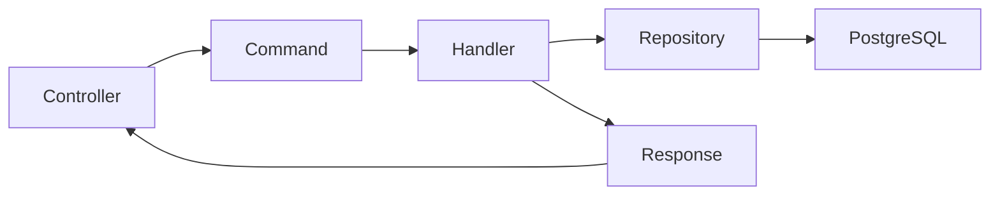

The application layer contains all Commands and Queries responsible for executing business use cases while keeping controllers thin.

---

# 🔐 Authentication

Authentication is implemented using JWT Access Tokens and Refresh Tokens.

Features include:

- Register
    
- Login
    
- JWT Authentication
    
- Refresh Token
    
- Protected APIs
    

Authentication flow:

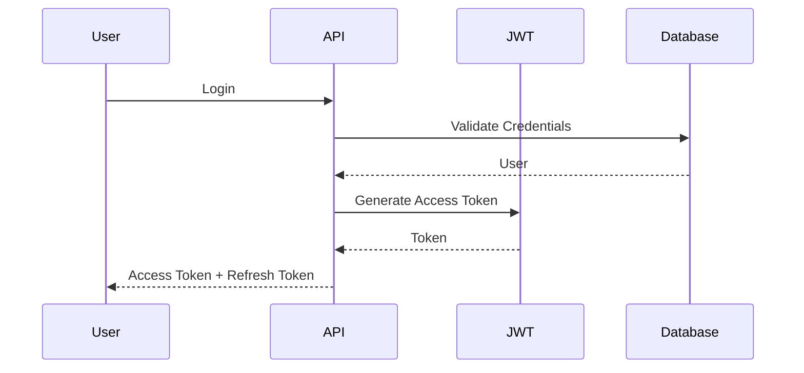

---

# 👤 Presence Module

The Presence module keeps track of connected users using SignalR.

Whenever a client connects or disconnects, their online status is updated and broadcast to other connected users.

Features:

- Online Users
    
- Offline Detection
    
- Live Status Updates
    
- Connection Tracking
    

Presence flow:

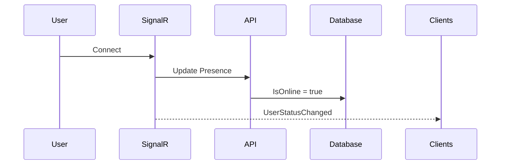

---

# 🗃️ Messaging Module

Messaging is divided into multiple responsibilities:

- Creating conversations
    
- Sending messages
    
- Retrieving chat history
    
- Processing attachments
    
- Reliable delivery using the Outbox Pattern
    

Each message becomes part of a conversation and can contain either text or an image attachment.

Instead of pushing everything directly, the application also demonstrates asynchronous processing through Domain Events and the Outbox Pattern.

# 📡 Communication Technologies

One of the main goals of TalkReal was to explore different communication styles commonly used in modern applications.

Instead of relying solely on REST APIs, the project intentionally implements multiple communication mechanisms to understand their strengths, limitations, and real-world use cases.

Not every technology was introduced because the application required it. Some were implemented as learning experiments to gain hands-on experience before using them in future production projects.

---

## REST API

REST is the primary communication layer of the application.

It is responsible for operations such as:

- Authentication
    
- User management
    
- Sending commands
    
- Uploading media
    
- Triggering business workflows
    

REST remains the simplest and most familiar way for the frontend to communicate with the backend.

---

## SignalR

SignalR powers the real-time experience.

Instead of polling the server, clients maintain a persistent connection and receive updates immediately.

Current responsibilities include:

- User presence (Online / Offline)
    
- Receiving new messages
    
- File processing notifications
    

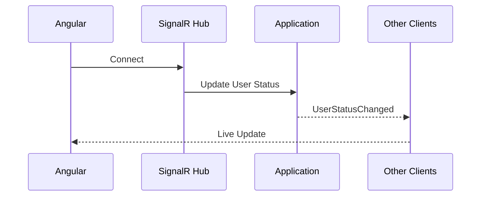

---

## GraphQL

GraphQL is used to retrieve chat history.

While REST could also handle this scenario, GraphQL was added to explore how clients can request only the data they actually need.

This helped demonstrate another communication style commonly used in modern applications.

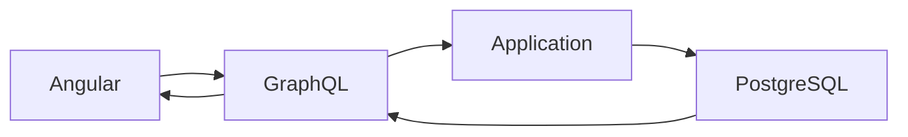

---

## gRPC

The project contains a simple gRPC implementation as an educational experiment.

Its purpose is **not** to optimize the current application, but to understand:

- Protocol Buffers
    
- HTTP/2 communication
    
- Service contracts
    
- High-performance service-to-service communication
    

This implementation serves as preparation for future distributed systems where internal services may communicate using gRPC.

---

## Webhooks

Webhooks were implemented to understand asynchronous communication with external services.

When an image is uploaded, an external provider (Cloudinary) can notify the application after processing the file.

The application then updates the message state and notifies connected users in real time.

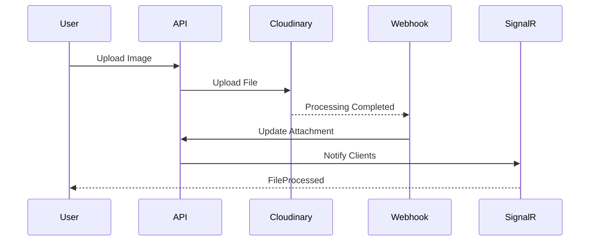

---

# 🔄 Reliable Messaging (Outbox Pattern)

One of the concepts explored in TalkReal is the **Outbox Pattern**.

Instead of immediately publishing events after saving data, both the business data and the integration event are stored within the same database transaction.

A background job later processes pending Outbox records, ensuring that failures do not result in lost events.

Although this project doesn't operate in a distributed production environment, implementing the Outbox Pattern provided valuable experience with reliable event-driven architectures.

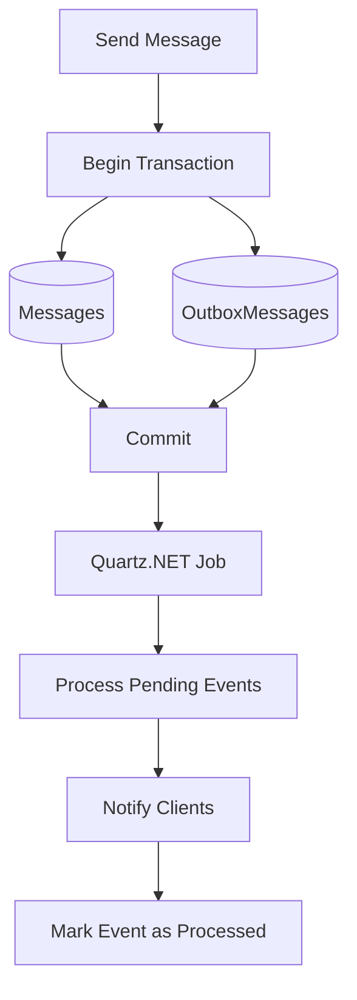

---

# 🎨 Frontend Highlights

The frontend is built with **Angular 21** and follows a component-based architecture.

The application is divided into feature pages, reusable UI components, shared services, and a dedicated core layer.

Highlights include:

- Standalone Components
    
- Tailwind CSS
    
- Apollo GraphQL Client
    
- SignalR Client
    
- Route Guards
    
- HTTP Interceptors
    
- Shared Layout Components
    
- Reusable UI Components
    
- Loading State Management
    
- Notification Service
    

The frontend communicates with the backend using different communication mechanisms depending on the scenario:

|Feature|Communication|
|---|---|
|Authentication|REST API|
|Send Message|REST API|
|Chat History|GraphQL|
|Live Updates|SignalR|
|Image Processing|SignalR + Webhook|
# 🐳 Docker

The project is fully containerized using Docker and Docker Compose to simplify local development and ensure a consistent environment across different machines.

The Docker setup includes:

- ASP.NET Core Backend
    
- Angular Frontend
    
- PostgreSQL Database
    

Running the entire application requires only a few commands without manually configuring the environment.

---

# 🚀 Getting Started

## Prerequisites

Before running the project, make sure you have:

- .NET 9 SDK
    
- Node.js
    
- Angular CLI
    
- Docker Desktop (Optional)
    
- PostgreSQL (if not using Docker)
    

---

## Clone the repository

```bash
git clone https://github.com/your-username/TalkReal.git

cd TalkReal
```

---

## Configure Environment Variables

Create your `.env` file using the provided example.

```text
variable example.env
```

Configure values such as:

- PostgreSQL Connection String
    
- JWT Secret
    
- Cloudinary Credentials
    

---

## Run with Docker

```bash
docker compose up --build
```

---

## Run without Docker

Backend

```bash
dotnet restore

dotnet ef database update

dotnet run --project API
```

Frontend

```bash
cd Front

npm install

ng serve
```

---

# 🔄 CI/CD

GitHub Actions is configured to automate the project's build pipeline.

The workflow validates the project before changes are merged, helping maintain a healthy codebase.

Current pipeline includes:

- Restore dependencies
    
- Build Backend
    
- Build Frontend
    
- Execute Tests
    

---

# 🌿 Branching Strategy

The repository follows a simple workflow.

|Branch|Purpose|
|---|---|
|main|Stable project|
|development|Active development|
|feature/*|Individual features and experiments|

---

# 🧪 Learning / Experimental Features

TalkReal intentionally contains implementations whose primary purpose is learning rather than solving a production requirement.

Examples include:

- GraphQL
    
- gRPC
    
- Webhooks
    
- Outbox Pattern
    

These implementations helped me understand how modern distributed applications communicate and process data beyond traditional REST APIs.

---

# 🔐 Security

Current security features include:

- JWT Authentication
    
- Refresh Tokens
    
- Route Protection
    
- Authorization Middleware
    
- Input Validation using FluentValidation
    
- Secure Password Storage
    
- Environment Variables for sensitive configuration
    

---

# 📦 Deployment

The application is designed to be deployment-ready.

Current deployment resources include:

- Docker
    
- Docker Compose
    
- GitHub Actions
    

Future deployment targets may include cloud platforms such as Azure or AWS.

---

# 📈 Future Roadmap

Future improvements may include:

- Group Conversations
    
- Message Read Receipts
    
- Typing Indicators
    
- Message Reactions
    
- Push Notifications
    
- Redis Caching
    
- Elasticsearch
    
- Distributed Event Bus
    
- Microservices Architecture
    

---

# 💡 Lessons Learned

TalkReal became much more than a chat application.

Every feature introduced a new concept, and every concept changed how I think about backend development.

Some of the biggest lessons from this project include:

- REST is only one communication style among many.
    
- Real-time systems require a different way of thinking than request-response applications.
    
- Clean Architecture makes large projects easier to organize.
    
- CQRS improves separation of responsibilities.
    
- Reliable systems often depend on asynchronous processing.
    
- Distributed systems require different communication protocols depending on the scenario.
    
- Learning a technology becomes much easier when it's implemented inside a real application instead of an isolated tutorial.
    

---

# ❤️ Engineering Journey

TalkReal started as a simple chat application.

Initially, the goal was only to practice ASP.NET Core and Angular.

As I continued learning, every new concept became an opportunity to extend the project.

SignalR introduced real-time communication.

GraphQL introduced flexible querying.

gRPC introduced high-performance service communication.

Webhooks demonstrated asynchronous callbacks from external services.

The Outbox Pattern introduced reliable event processing.

Docker simplified development and deployment.

GitHub Actions automated the build process.

Looking back, TalkReal reflects not only what I built, but how my understanding of backend engineering evolved throughout the journey.

This repository represents my learning process far more than it represents a finished product—and that is exactly what it was intended to be.

---

# 🤝 Contributing

This repository is primarily a personal learning project.

However, suggestions, discussions, and constructive feedback are always welcome.

If you find something that could be improved or simply want to share another approach, feel free to open an Issue or submit a Pull Request.

---

# 📄 License

This project is licensed under the MIT License.

See the LICENSE file for more information.

---

# 👨‍💻 Author

**Omar Emad**

Software Engineer | Fullstack Dev

Online Resume :  
https://omar-emad.vercel.app/

LinkedIn:  
https://www.linkedin.com/in/omar-abusaif/

---

# ⭐ Support

If you found this project interesting or helpful, consider giving it a ⭐ on GitHub.

It helps others discover the project and motivates me to continue learning and building new software.
